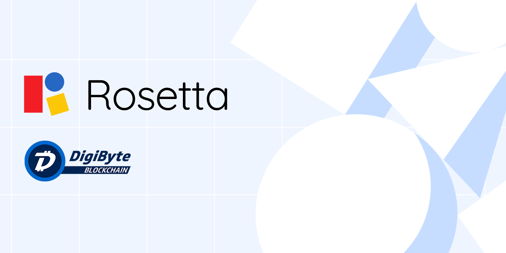

# 

## DigiByte Rosetta Server

### Versions

DigiByte Rosetta Server Version: 1.0.0

Coinbase Rosetta Version: 1.4.1

### About

DigiByte Rosetta Server is a Dockerized implementation of the [Coinbase Rosetta Specification](https://www.rosetta-api.org/) written in the ubiquitous NodeJS framework to make it easier for the developer community to integrate with and build upon the DigiByte Blockchain.  To learn more about the specification and how you can integrate with it, view the full specifcation documentation [here](https://www.rosetta-api.org/docs/Reference.html).

### Prerequisites

1. Mac OS & Ubuntu are recommended operating systems.  Any Linux distrobution should work fine.

1. Install Docker Desktop by following the instructions for either [MacOS](https://docs.docker.com/desktop/install/mac-install/) or [Ubuntu](https://docs.docker.com/desktop/install/linux-install/)

### Docker Build Steps

#### 1. Clone the container using git

```bash
git clone https://github.com/DigiByte-Core/digibyte-rosetta-server.git
```

#### 2. Build the docker image

When building the docker image, a variety of build arguments are available.  Please review the available args in the [Dockerfile](./Dockerfile).  

##### Build for DigiByte regtest

```bash
# Build the docker image for regtest (may take a while).
# Other build args are documented in ./Dockerfile
cd digibyte-rosetta-server
docker build -t digibyte/rosetta:latest --build-arg use_regtest=1 .
```

##### Build for DigiByte testnet

> NOTE: At this time, testnet is intermitently available and will be resolved with the release of 8.22

```bash
# Build the docker image for testnet (may take a while).
# Other build args are documented in ./Dockerfile
cd digibyte-rosetta-server
docker build -t digibyte/rosetta:latest --build-arg use_testnet=1 .
```

##### Build for DigiByte mainnet

```bash
# Build the docker image for testnet (may take a while).
# Other build args are documented in ./Dockerfile
cd digibyte-rosetta-server
docker build -t digibyte/rosetta:latest --build-arg use_testnet=0 .
```

> NOTE: On linux operating systems, `sudo` may be required for any `docker build` commands.

#### 3. Start the docker container

##### Start using DigiByte regtest

```bash
# This command will start the docker container for regtest.
# In this example, docker will forward two ports: 8080, and 18444.
# Port 8080/tcp is the port of the rosetta api server.
# Port 18444/tcp is the p2p regtest port.
docker run -p 18444:18444 -p 8080:8080 digibyte/rosetta:latest
```

##### Start using DigiByte testnet

> NOTE: At this time, testnet is intermitently available and will be resolved with the release of 8.22

```bash
# This command will start the docker container for testnet.
# In this example, docker will forward two ports: 8080, and 12026.
# Port 8080/tcp is the port of the rosetta api server.
# Port 12026/tcp is the p2p testnet port.
docker run -p 12026:12026 -p 8080:8080 digibyte/rosetta:latest
```

##### Start using DigiByte mainnet

```bash
# This command will start the docker container for mainnet use.
# In this example, docker will forward two ports: 8080, and 12024.
# Port 8080/tcp is the port of the rosetta api server.
# Port 12024/tcp is the p2p mainnet port.
docker run -p 12024:12024 -p 8080:8080 digibyte/rosetta:latest
```

> NOTE: On linux operating systems, `sudo` may be required for any `docker run` commands.

### Test

1. From the root of the cloned repository,run `npm install`

2. Run `npm run test` in order to run the JavaScript unit tests.

3. Run `npm run test-api` in order to test the data api and construction api in an online/offline environment built with docker-compose.

> NOTE: On linux you may need to modify the above Node scripts to add `sudo` to any `docker` commands.

Several example requests to test the reachability of your node using curl are shown in this document: [Example Requests](./docs/ExampleRequests.md).
An example on how to validate a mainnet account balance is shown here: [Validation](./docs/Validation.md)

### Implementation Details

This Rosetta implementation is using the [Rosetta Node SDK](https://github.com/DigiByte-Core/digibyte-rosetta-nodeapi.git).

A UTXO-Indexing Middleware was implemented to enable balance lookups. Historical balance lookups are supported as well.
By using the `Syncer` class of the Rosetta SDK, the sync has become exceptionally reliable and even reorgs are supported very well. LevelDB (the same database that is being used in Bitcoin and its forks) is used to store the UTXO data. A space efficient encoding was chosen in order to avoid redundancy and to save some disk space (usage: 6.7G, as of 08th September, 2020), as described [here](docs/utxoIndexer.md).

- [x] Fast, reliable sync
- [x] Space efficient, non-redundant implementation
- [x] Tested with addresses that have more than 399k transactions (historical balance calculation may take several seconds for these accounts)
- [x] Balances are subtracted and UTXOs removed on reorgs (which happen several times a day)

Note, that the addition of an UTXO database is heavily discussed in the official Bitcoin Mailgroup. As soon as this feature is added, many altcoins will probably apply the changes too, and the above UTXO middleware will most likely become obsolete.

### ToDos

- [x] Implement Construction API for Offline and Online Environments
- [x] Test the node using coinbase's [rosetta-cli](https://github.com/coinbase/rosetta-cli.git) ([Results](docs/LivenetValidationResults.md))
- [x] Run the mainnet node and wait for full sync
- [x] Test some utxo balance checks ([Results](docs/Validation.md))
- [ ] Update to the Coinbase Rosetta Specification version 1.4.12
- [ ] Setup Continuous Integration
